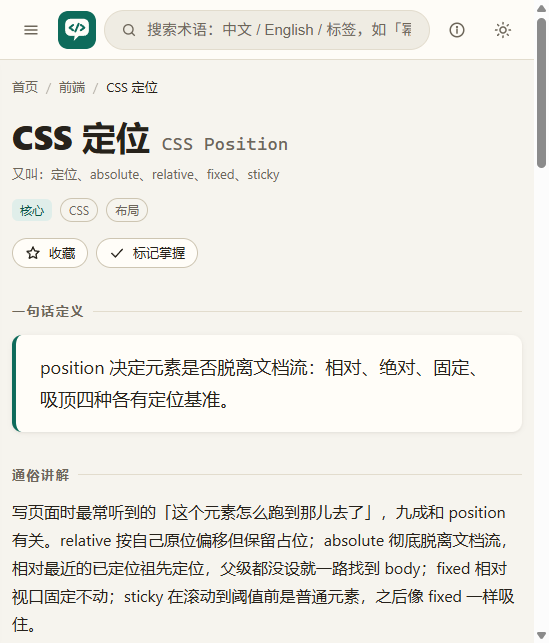

<div align="center">

# JargonBuster · 标准术语 StandardTerm

**把技术黑话说成人话** —— 一份开放的技术规范用语知识库

和 AI 结对编程、读文档、开会评审时，总有些词「眼熟但说不清」。本站把常用技术术语按场景分类，
每个词条提供：**一句话定义 · 通俗讲解 · 生活类比 · 「怎么对 AI 说」· 常见误解**，
并为必要概念配了 **SVG 图解** 与 **可播放的 CSS 动画**。


[](https://github.com/Shrbuz/JargonBuster)
[](https://github.com/Shrbuz/JargonBuster)

**在线访问：** <https://st.ewri.site/>




</div>

---

## 它解决什么问题

看 AI 生成的代码、读官方文档、开会评审时，总有那么些词「见过但说不清」——`幂等`、`层叠上下文`、`竞态`、`RAG`。
说不清就难提问、难沟通、难验收。这个项目把高频技术术语按场景整理成「能直接拿去用」的口语化解释，
尤其是 **「怎么对 AI 说」** 栏目：同一件事，含糊说法 vs 准确说法，AI 给出的实现质量天差地别。

## 特性

- **纯静态零构建**：无框架、无依赖、无打包，`git pull` 即部署
- **十大分类 × 448 词条**：编程基础 / 数据结构与算法 / 前端 / 后端 / 数据库 / 网络协议 / Git 协作 / 工程实践 / 架构设计 / AI 与大模型
- **全站搜索**：中文、English、别名、标签、正文全文匹配，图鉴元素一并命中；`/` 聚焦，`↑↓` 选择，`Enter` 跳转
- **可视化标准术语图鉴**：网页与 App 常见界面元素按「基础 / 表单 / 导航 / 数据展示 / 反馈 / 浮层 / 媒体 / 布局 / 视觉技法 / 动效」分组，每个元素 = 标准名与别名 + 一句话描述 + 真实呈现标本；搜「走马灯」直达轮播、搜「毛玻璃」直达毛玻璃，词条页与图鉴双向互链
- **学习路线**：循序渐进的路径把散落词条串起来，含 UI 沟通速查线
- **学习进度与收藏**：localStorage 本地记录「已掌握」，分类进度条可视化
- **图示与动画**：27 张手绘 SVG 图解随主题变色；20 个循环概念动画可暂停重播
- **媒体槽位机制**：词条可预留图示位置，后续优雅填充，页面永不破版
- **深浅双主题 · 移动端适配 · 无障碍**（焦点态 / aria / 减动效偏好）

## 内容一览

| 分类 | 词条数 | 分类 | 词条数 |
| --- | --- | --- | --- |
| 编程基础 | 36 | 网络协议 | 35 |
| 数据结构与算法 | 35 | Git 协作 | 32 |
| 前端 | 128 | 工程实践 | 36 |
| 后端 | 38 | 架构设计 | 34 |
| 数据库 | 34 | AI 与大模型 | 36 |

## 快速开始

```bash
# 方式一：什么都不装，直接用浏览器打开
index.html

# 方式二：起个本地静态服务（可选）
node tools/serve.js        # 或 npx serve .
```

## 部署到服务器

本仓库没有任何构建步骤——**拉取下来就是成品**。

```bash
git clone https://github.com/Shrbuz/JargonBuster.git /var/www/standard-term
cd /var/www/standard-term && git pull
```

然后让任意静态服务器指向该目录即可：

- **Nginx**：参考 [`deploy/nginx.conf.example`](deploy/nginx.conf.example)
- **宝塔面板**：参考 [`deploy/bt_add_site.py`](deploy/bt_add_site.py)（调 panelSite.AddSite 幂等注册纯静态站点）
- **GitHub Pages**：仓库设置里选择根目录分支作为发布源
- **Vercel / Netlify / Cloudflare Pages**：Framework Preset 选 Other / 无，发布目录填仓库根目录

## 数据质量保障

内容不是一次性生成的「水词条」，而是按统一规范维护、可自动校验：

```bash
node tools/validate.js   # 数据完整性校验（ID 唯一 / 分类存在 / 必填字段 / related 引用 / 文本规范）
node tools/smoke.js      # 运行时冒烟测试（搜索 / 图鉴 / 路由与启动链路）
```

## 如何贡献

### 添加一个词条

1. Fork 仓库，找到词条所属分类的数据文件（如后端词条进 `assets/js/data/terms.backend.js`）；
2. 按下方字段模板追加对象，保持既有「讲人话」文风；
3. 运行校验 `node tools/validate.js`，直到输出「全部通过 ✓」；
4. 提交 Pull Request，标题写明新增词条。

### 词条字段规范（核心字段）

| 字段 | 必填 | 说明 |
| --- | --- | --- |
| `id` | ✓ | 全局唯一，小写英文连字符，如 `connection-pool` |
| `en` / `zh` | ✓ | 英文原名 / 中文名 |
| `aliases` | - | 别名数组，参与搜索 |
| `cat` | ✓ | 分类 id（须在 `categories.js` 中已定义） |
| `tags` | ✓ | 2~4 个标签 |
| `level` | ✓ | `core` / `common` / `advanced` |
| `summary` | ✓ | 一句话定义 ≤40 字 |
| `plain` | ✓ | 数组 2~3 段通俗讲解，共 200~350 字 |
| `analogy` | ✓ | 一句生活类比 |
| `talk.good` / `talk.bad` | ✓ | 对 AI 的准确说法示例 / 含糊说法及问题 |
| `misconceptions` | ✓ | 1~2 条常见误解 |
| `related` | - | 相关词条 id 数组（必须真实存在） |
| `visual` | - | `{kind:'svg',id}` / `{kind:'anim',id}` / `{kind:'img',src 或 pending:true}` |

### 添加一个图鉴元素

1. 在 `assets/js/data/visual-elements.js` 找到所属分组追加元素（`id / name / en / aliases / desc / demo`，可选 `term` 关联词条）；
2. 在 `assets/js/visual-demos.js` 注册同名 `demo` 标本：纯静态 HTML，类名 `vd-*` 前缀，颜色只用设计令牌；
3. 需要新样式时在 `assets/css/visual-page.css` 补充，运行 `node tools/smoke.js` 直到「全部通过 ✓」。

### 贡献守则

- 讲人话：先说结论再展开，避免论文腔；可用「你」称呼读者
- 不臆造：不确定的 API 行为、数字参数宁可泛化表述，不要编造
- 克制配图：只在真正有助于理解的词条加 visual，其余保留槽位
- 一个 PR 聚焦一件事：加词条、修文案、调样式分开提交

## 目录结构

```
standard-term/
├── index.html              # 单页入口（hash 路由，可直接双击打开）
├── docs/                   # 文档与演示截图
├── assets/
│   ├── css/                # 设计令牌 / 布局 / 视图 / 详情 / 图鉴 / 动画
│   ├── js/
│   │   ├── data/           # 十大分类词条数据 + 图鉴元素数据（内容都在这）
│   │   ├── visuals.js      # SVG 图解注册表
│   │   ├── visual-demos.js # 图鉴元素呈现效果注册表
│   │   ├── anims.js        # 动画注册表
│   │   └── …               # 数据聚合 / 搜索 / 组件 / 视图 / 路由 / 入口
│   └── img/                # 图片媒体槽位
├── tools/
│   ├── validate.js         # 数据完整性校验（零依赖）
│   ├── smoke.js            # 运行时冒烟测试
│   └── serve.js            # 本地预览服务器
├── deploy/
│   └── nginx.conf.example  # Nginx 配置示例
└── README.md
```

## 授权

- 站点代码：**MIT**（见 [`LICENSE`](LICENSE)）
- 词条内容：**CC BY-SA 4.0**（见 [`LICENSE-content`](LICENSE-content)，转载须署名并以相同方式共享）
